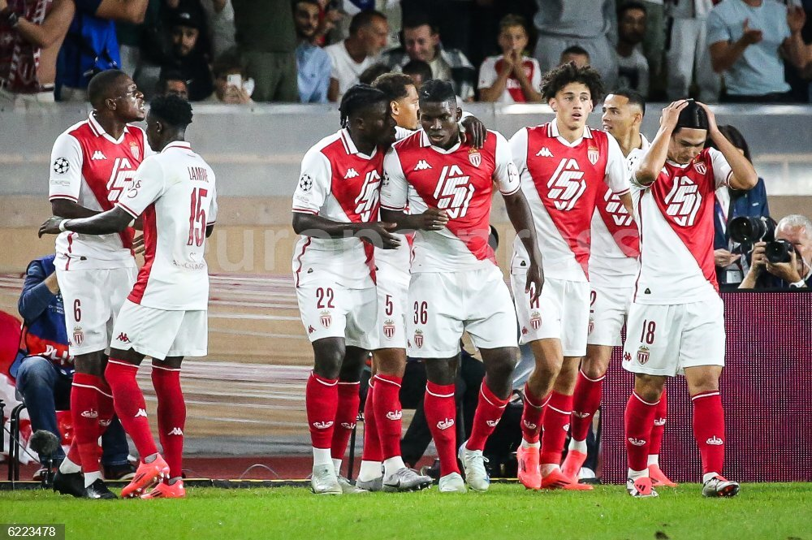
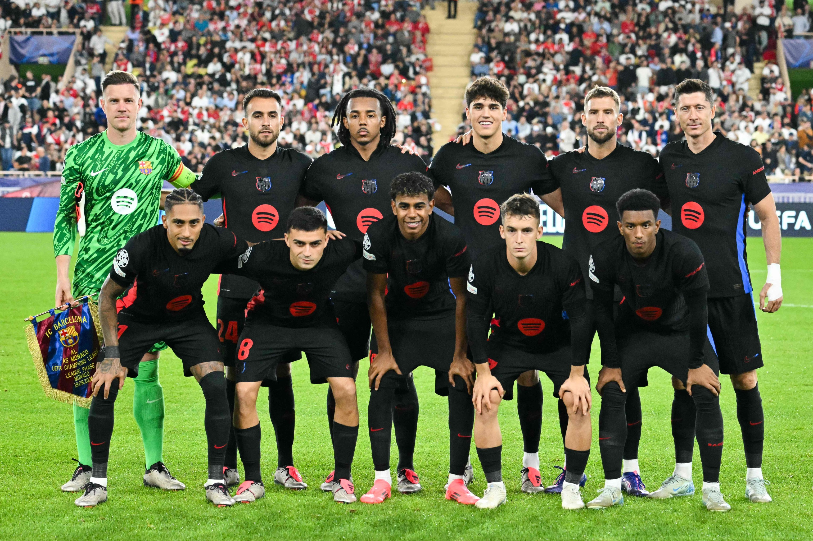
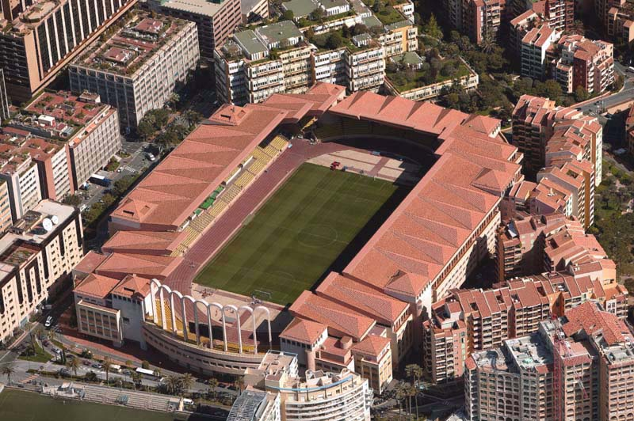

# Cronica Monaco-Fc Barcelona

## Estadisticas
 
 **FICHA TÉCNICA.**

-RESULTADO: AS MÓNACO, 2 - FC BARCELONA, 1 (1-1, al descanso).

**-EQUIPOS.**

*AS MÓNACO*: Köhn; Singo, Kehrer, Salisu, Vanderson (Mawissa, min.88); Camara (Golovin, min.46), Zakaria; Akliouche, Minamino (Balogun, min.69), Ben Seghir (Henrique, min.69); y Embolo (Ilenikhena, min.59).

*FC BARCELONA*: Ter Stegen; Koundé, Cubarsí (Ferran Torres, min.80), Iñigo Martínez, Balde (Ansu Fati, min.88); Casadó, Eric Garcia; Lamine Yamal (Gerard Martín, min.80), Pedri (Pablo Torre, min.83), Raphinha; y Lewandowski (Sergi Domínguez, min.80).

**-GOLES.**

1-0. Min.16, Akliouche.

1-1. Min.28, Lamine Yamal.

2-1. Min.71, Ilenikhena.

**-ÁRBITRO**: Allard Lindhout (NED). Amonestó a *Ben Seghir* (min.30), *Camara* (min.36), *Zakaria* (min.90+2) y *Balogun* (min.90+6) en el **Mónaco** y a *Iñigo Martínez* (min.75), *Balde* (min.85) y *Casadó* (min.85) en el **FC Barcelona.** Expulsó con roja directa a *Eric Garcia* (min.11) en el FC Barcelona.

**-ESTADIO:** *Stade Louis II.*

## Cronica

El partido empezó a las 9 de la noche, a los 1o minutos el árbitro del partido **Allard Lindhout** expulso con roja directa a *Eric García* tras un fallo del capitán del FC Barcelona *Marc Andre Ter-Stegen* que le dio la pelota a *Eric Garica* cuando el defensor se encontraba cubierto por dos jugadores del monaco. En el minuto 16 marcaría el jugador del Monaco *Akliouche^* que tiraría al palo corto y *Ter-Stegen* no pudo hacer nada para parar el disparo del joven delantero francés.

En el minuto 28 marcaría gol *Lamine Yamal* tras un pase bueno de Kounde que Lamine le metería cuerpo a Vanderson para que ese balón pasara y luego *Lamine Yamal* aria una jugada expectacular con el gol al palo corto del portero.

En el minuto 71 *Ilenikhena marcaria* a placer después de un gran pase de su compañero Zakaria que le dejaría mano a mano contra *Ter-Stegen* que no pudo hacer nada.

En el minuto 96 el árbitro **Allard Lindhout** pitaría el final del partido.

