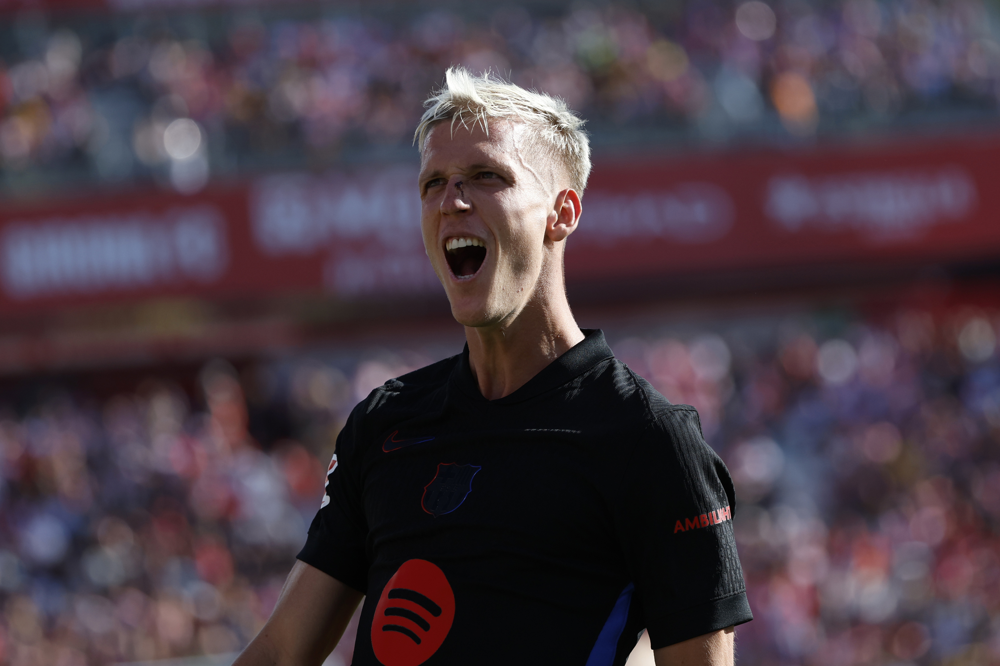
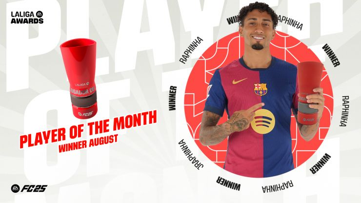

# Fc Barcelona - Monaco 

Hoy se juega el Fc barcelona monaco a las 9 i apunta a ser de los mejores partidos de la jornada.

**Hansi Flick** comneto en rueda de prensa que **Ansu Fati** jugara bastantes minutos en el partido pero que no dira la posicon.

Para este partido el entrenador blaugrana no podra contar con uno de sus mejores jugadores en este inicio **Dani Olmo** 
Que apunta a estar lesionado ente **4-5 semanas**

Recordemos que el inicio de la temporada para el equipo cule perdio **3-0** contra el monaco en el trofeo carateristico del **Fc Barcelona** el **Joan Gamper**

En este arranque de liga el **Fc Barcelona** a sido dominate contra todos sus rivales hasta la fecha 5 con resultados favorables como un 7-0 conta el **Valladolid**, un 4-1 al **Girona**, y tres partidos segidos de 2-1 contra **Valencia Atletich club de Bilbao y Rayo Vallecano**

En la Liga española el **Fc Barcelona** cuenta con el ganador al **Manager del mes** ganado por **Hansi Flick**  

Tambien con el mejor jugador del mes **Raphinha** 

Y por ultimo **Lamine Yamal** a ganado el trofeo a mejor jugador sub 23 

 

